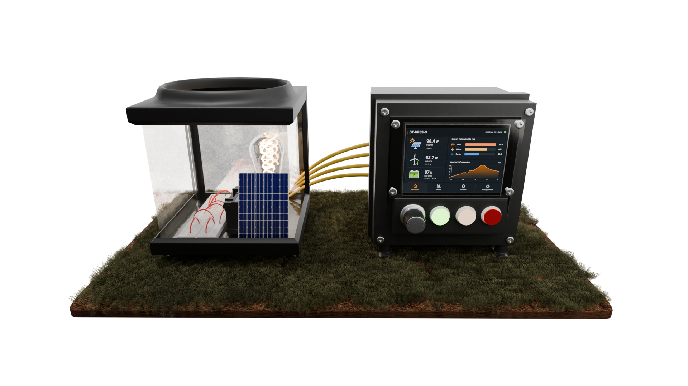
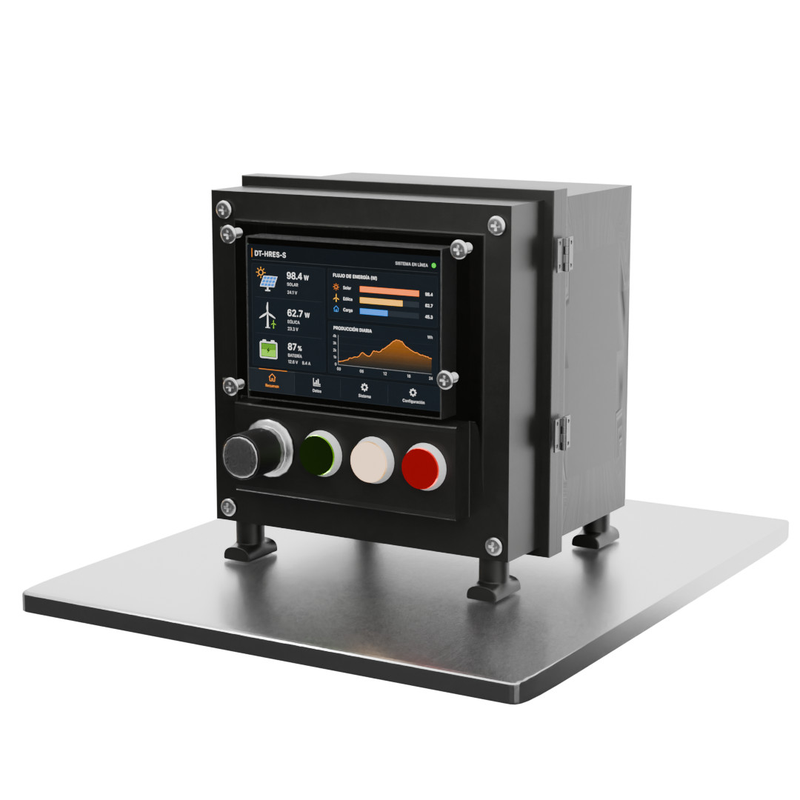
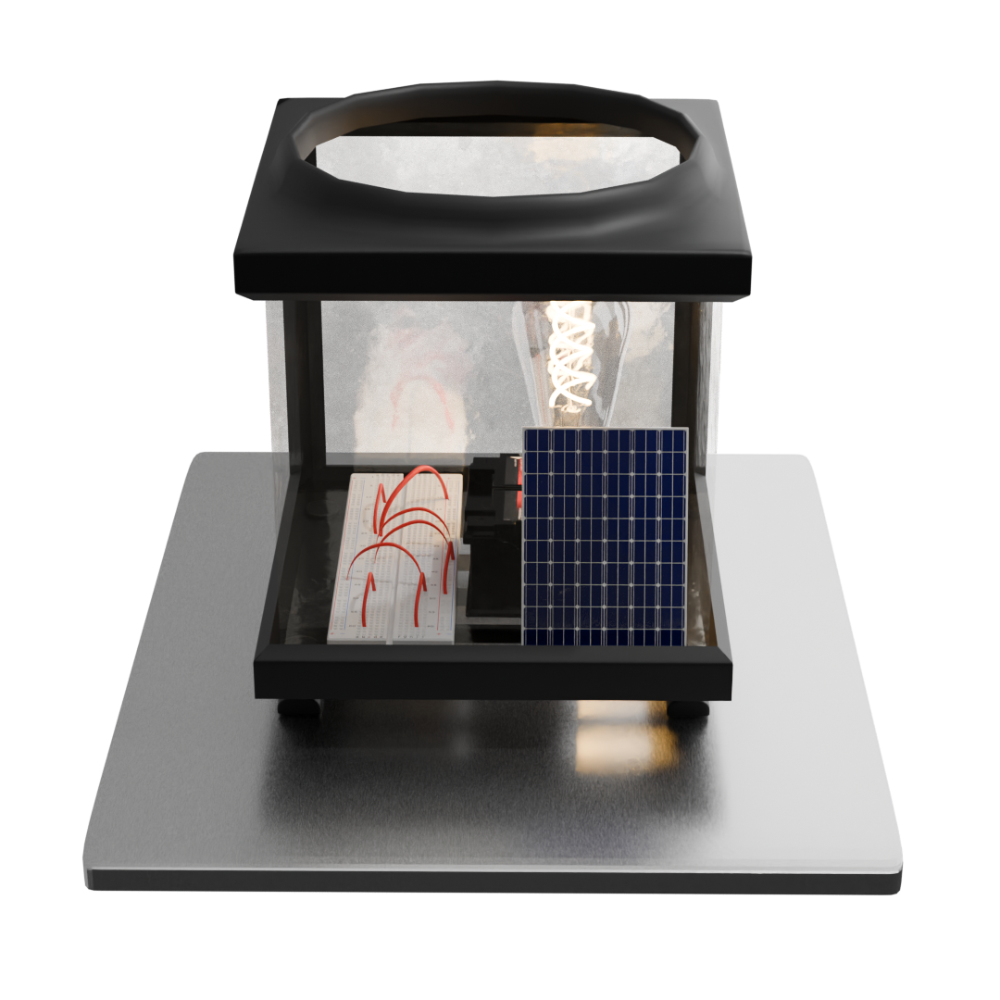

# DT-HRES-S

Gemelo digital de un sistema híbrido de energía renovable, en formato de instrumento educativo para comunidades indígenas.

<table>
<tr>
<td align="center"></td>
</tr>
<tr>
<td>

### El instrumento completo

Dos cajas acopladas por la parte trasera. Al frente, la unidad de control en coraza impresa en 3D negra: pantalla tras ventana de acrílico, rueda y tres botones, verde, ámbar y rojo. Las bisagras laterales abren hacia los componentes internos.

Detrás, el instrumento observador: caja de paredes de acrílico, con abertura circular en la parte superior y ductos de ventilación en la base, que aloja el circuito de principios armado en protoboard, con panel solar y batería encendiendo una bombilla.

El circuito de la caja trasera es el sistema físico. La pantalla del frente es el gemelo digital de ese mismo sistema.

</td>
</tr>
</table>

<table>
<tr>
<td width="50%" align="center"></td>
<td width="50%" align="center"></td>
</tr>
<tr>
<td valign="top">

**Unidad de control**

Raspberry Pi 5 con la pantalla protegida por acrílico. El modelo entrenado corre aquí, sin conexión a internet.

</td>
<td valign="top">

**Instrumento observador**

Caja de acrílico con abertura circular superior y ventilación inferior. El armado queda a la vista, conexión por conexión.

</td>
</tr>
</table>

## Contexto

El instrumento está dirigido a comunidades indígenas que operan o evalúan operar un sistema híbrido de energía renovable.

Donde ya existe una instalación, la réplica de la caja trasera reproduce a escala lo que ocurre en ella, y la pantalla del frente traduce ese comportamiento a números y gráficas: producción del panel a lo largo del día, estado de la batería, consumo cubierto.

Donde todavía no hay instalación, el armado en protoboard queda expuesto a propósito. Cada conexión se sigue a simple vista, se mide y se reproduce con material local. El gemelo digital, entrenado con datos meteorológicos, estima el tamaño de panel, turbina y batería que corresponde al consumo de la comunidad.

## Cómo está armado

La unidad de control lleva una Raspberry Pi 5 dentro de una coraza impresa en 3D. La pantalla de 7 pulgadas va detrás de una ventana de acrílico, sin táctil: la interacción ocurre con una rueda giratoria y tres botones de panel. La rueda mueve la selección y confirma al presionarla; el verde avanza, el ámbar regresa, el rojo reinicia la captura. Las bisagras abren la coraza hacia los componentes, accesibles para mantenimiento o para mostrar el interior durante un taller.

El instrumento observador va aparte y se conecta por la parte trasera. Sus paredes de acrílico dejan ver el circuito completo. La abertura circular superior deja pasar la luz hacia el panel solar, y los ductos de la base mantienen el flujo de aire sobre los componentes.

## Del Colab a la Raspberry

El entrenamiento vive en Google Colab y no se mueve de ahí. El conjunto de datos se genera con la simulación física del repositorio, barriendo combinaciones de tamaño de panel, turbina y batería sobre los años meteorológicos típicos de cuatro ciudades. Sobre ese conjunto se entrenan y comparan árbol de decisión, bosque aleatorio, máquina de vectores de soporte y red neuronal, con validación dejando una ciudad fuera, que mide la respuesta del modelo en un sitio que nunca vio.

A la Raspberry se copia únicamente el resultado: el modelo ganador serializado con joblib y los datos meteorológicos precargados. El dispositivo no entrena, solo hace inferencia, y esa inferencia corre en la CPU de la Pi en milisegundos. No lleva acelerador de IA porque el bosque aleatorio no lo requiere; esa decisión se revisa solo si un modelo más pesado demuestra ventaja medible en latencia y precisión sobre el hardware real.

## Instrumentos

### Unidad de control

| Componente | Especificación |
|---|---|
| Raspberry Pi 5 | 8 GB RAM |
| Almacenamiento | microSD industrial 64 GB, SSD USB 256 GB |
| Pantalla | 7", 1024x600, IPS, tras ventana de acrílico |
| Rueda | encoder rotatorio con pulsador, eje metálico |
| Botones | 22 mm, IP67, verde, ámbar, rojo |
| Coraza | impresión 3D negra, con bisagras |
| Disipación | disipador activo con ventilador |

### Instrumento observador

| Componente | Especificación |
|---|---|
| Panel solar | 20 W, 12 V |
| Batería | LiFePO4 12 V |
| Controlador de carga | PWM 10 A |
| Carga | bombilla |
| Montaje | protoboard a la vista |
| Caja | acrílico, abertura circular superior, ductos de ventilación inferiores |

### Sensores meteorológicos, opcionales

| Componente | Especificación |
|---|---|
| Piranómetro | irradiancia global |
| BME280 | temperatura, humedad, presión |
| Anemómetro | copas, salida de pulsos |

## Software

| Capa | Contenido |
|---|---|
| Sistema | Raspberry Pi OS Lite |
| Cálculo | Python 3.11, scikit-learn, joblib, pandas, numpy |
| Interfaz | pantalla completa, sin escritorio |
| Entrada | gpiozero para rueda y botones |
| Arranque | servicio systemd al encender |

## Repositorio

| Carpeta | Contenido |
|---|---|
| data/ | años meteorológicos típicos de cuatro ciudades |
| src/ | modelos físicos, simulador y modelos de aprendizaje |
| notebooks/ | prototipo, interfaz comunitaria y recorrido de la metodología |
| docs/ | metodología y guía de investigación |
| tests/ | pruebas de los módulos |

## Documentación

[Metodología 4D](docs/4D_methodology/)

[Guía de investigación](docs/RESEARCH_GUIDE.md)

## Licencia

CC BY-NC-SA 4.0

---

EPICS in IEEE 2025-2026 | Tecnológico de Monterrey | Technical Arts, capítulo estudiantil ITESM

Project lead | PhD Rasikh Tariq
